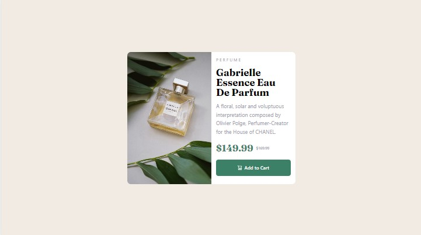

# Frontend Mentor - Product preview card component solution

This is a solution to the [Product preview card component challenge on Frontend Mentor](https://www.frontendmentor.io/challenges/product-preview-card-component-GO7UmttRfa). Frontend Mentor challenges help you improve your coding skills by building realistic projects. 

## Table of contents

- [Overview](#overview)
  - [The challenge](#the-challenge)
  - [Screenshot](#screenshot)
  - [Links](#links)
- [My process](#my-process)
  - [Built with](#built-with)
  - [What I learned](#what-i-learned)
  - [Continued development](#continued-development)
  - [Useful resources](#useful-resources)
- [Author](#author)

## Overview

### The challenge

Users should be able to:

- View the optimal layout depending on their device's screen size
- See hover and focus states for interactive elements

### Screenshot

### Links

- Solution URL: (https://github.com/muhrizmrz/product-preview-card)
- Live Site URL: (https://muhrizmrz.github.io/product-preview-card/)

## My process

### Built with

- Semantic HTML5 markup
- CSS custom properties
- Flexbox
- Mobile-first workflow
- [Tailwind CSS](https://tailwindcss.com/) - CSS framework

### Continued development

I want to continue focus on responsive design

### Useful resources

- [Tailwind CSS](https://tailwindcss.com/) - This helped me for CSS classes and customized classes. I really liked this pattern and will use it going forward.

## Author

- Frontend Mentor - [@muhrizmrz](https://www.frontendmentor.io/profile/muhrizmrz)

